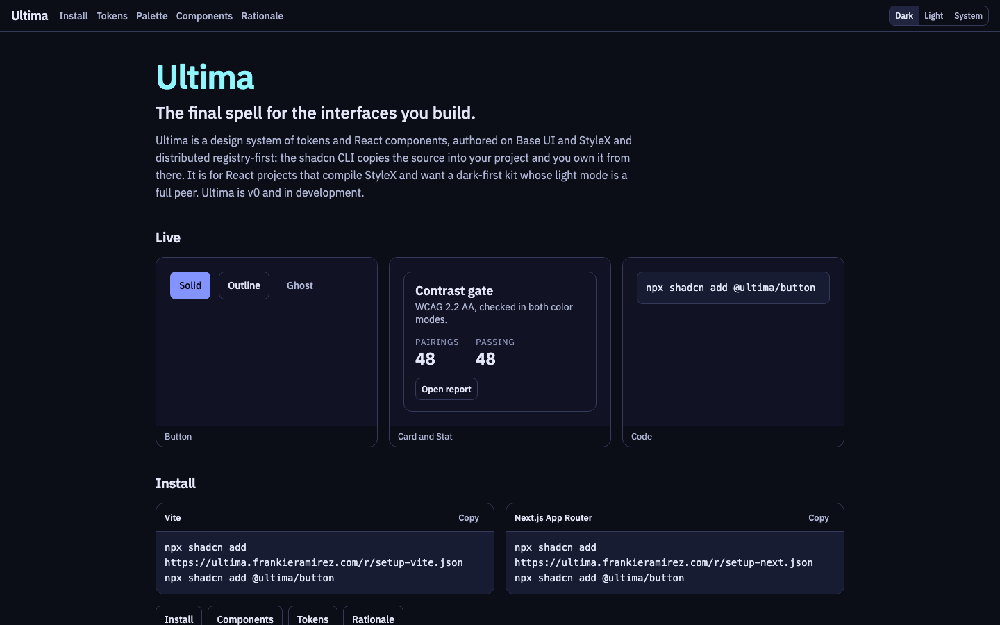

Ultima is a design system of tokens and React components, authored on Base UI and StyleX. It ships registry-first: the shadcn CLI copies the source into your project and you own it from there. Dark is the default and light is a full peer.

Ultima is v0 and in development.



## Install

Vite:

```bash
npx shadcn add https://ultima.frankieramirez.com/r/setup-vite.json
npx shadcn add @ultima/button
```

Next.js App Router:

```bash
npx shadcn add https://ultima.frankieramirez.com/r/setup-next.json
npx shadcn add @ultima/button
```

The first command writes `components.json` and the StyleX compiler config. The second installs Button and, through it, the tokens and the shared lib. The long form with the steps you still do by hand is on the site.

## Docs

- [Install](https://ultima.frankieramirez.com/install)
- [Components](https://ultima.frankieramirez.com/components)
- [Tokens](https://ultima.frankieramirez.com/tokens)
- [Rationale](https://ultima.frankieramirez.com/rationale)

## Stack

- [Base UI](https://base-ui.com) for the primitives.
- [StyleX](https://stylexjs.com) for styling, with tokens as the only source of raw values.
- A [shadcn](https://ui.shadcn.com/docs/registry) registry for distribution.
- Vite and TanStack Router for the docs site, which also serves the registry and the tokens export.

## Related

[mana](https://github.com/frankieramirez/mana) is the audit toolkit whose report is Ultima's first consumer.

## License

[MIT](LICENSE)
